# Arquitectura de Software - Pinneacle Perfumería

## 📋 Índice

1. [Visión Arquitectónica](#visión-arquitectónica)
2. [Diagrama de Arquitectura General](#diagrama-de-arquitectura-general)
3. [Diagrama de Clases](#diagrama-de-clases)
4. [Diagrama de Secuencia](#diagrama-de-secuencia)
5. [Diagrama de Entidad-Relación](#diagrama-de-entidad-relación)
6. [Diagrama de Estados](#diagrama-de-estados)
7. [Diagrama de Componentes](#diagrama-de-componentes)
8. [Patrones de Diseño](#patrones-de-diseño)
9. [Flujo de Datos](#flujo-de-datos)

---

## Visión Arquitectónica

### Arquitectura General

Pinneacle Perfumería sigue una **arquitectura JAMstack (JavaScript, APIs, Markup)** con:

- **Frontend**: Next.js 15 con Server Components
- **Backend**: WooCommerce GraphQL API (Headless CMS)
- **State Management**: React Context + localStorage
- **Estilo**: Tailwind CSS 4
- **Tipo**: SPA con renderizado híbrido (Server + Client)

### Principios Arquitectónicos

1. **Separación de Responsabilidades**: Frontend y backend desacoplados
2. **Server-First**: Server Components por defecto, Client Components cuando es necesario
3. **Progressive Enhancement**: Funcionalidad básica sin JavaScript, mejorada con React
4. **Data Locality**: Los datos viven cerca de donde se usan
5. **Optimistic UI**: Actualizaciones inmediatas con validación posterior

---

## Diagrama de Arquitectura General

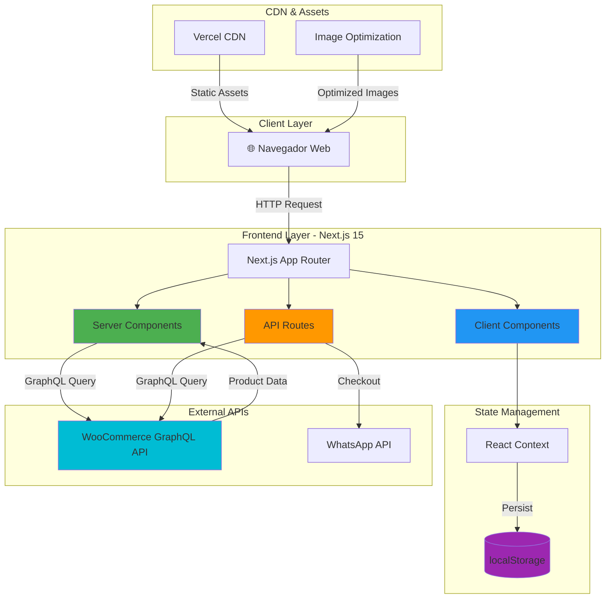

---

## Diagrama de Clases

### Clases Principales del Sistema

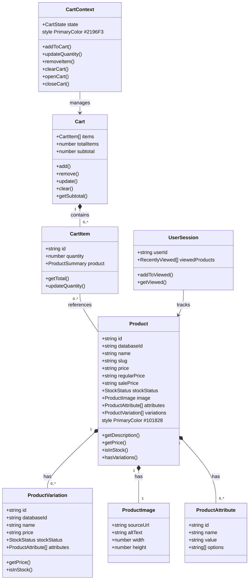

### Clases de Componentes React

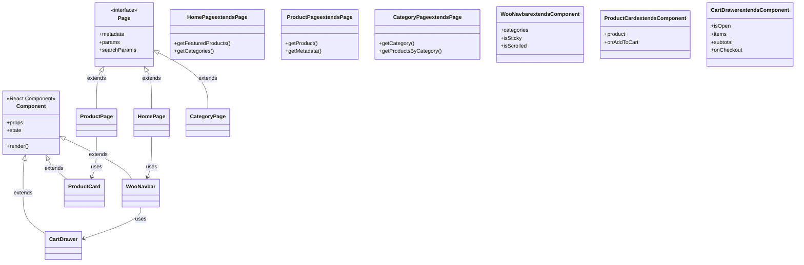

---

## Diagrama de Secuencia

### Secuencia 1: Agregar Producto al Carrito

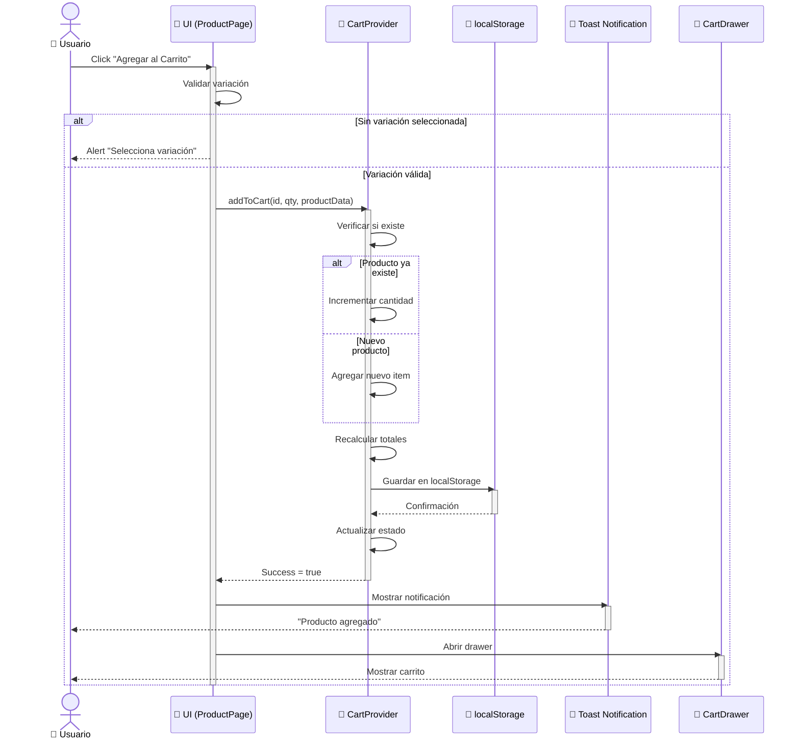

### Secuencia 2: Checkout por WhatsApp

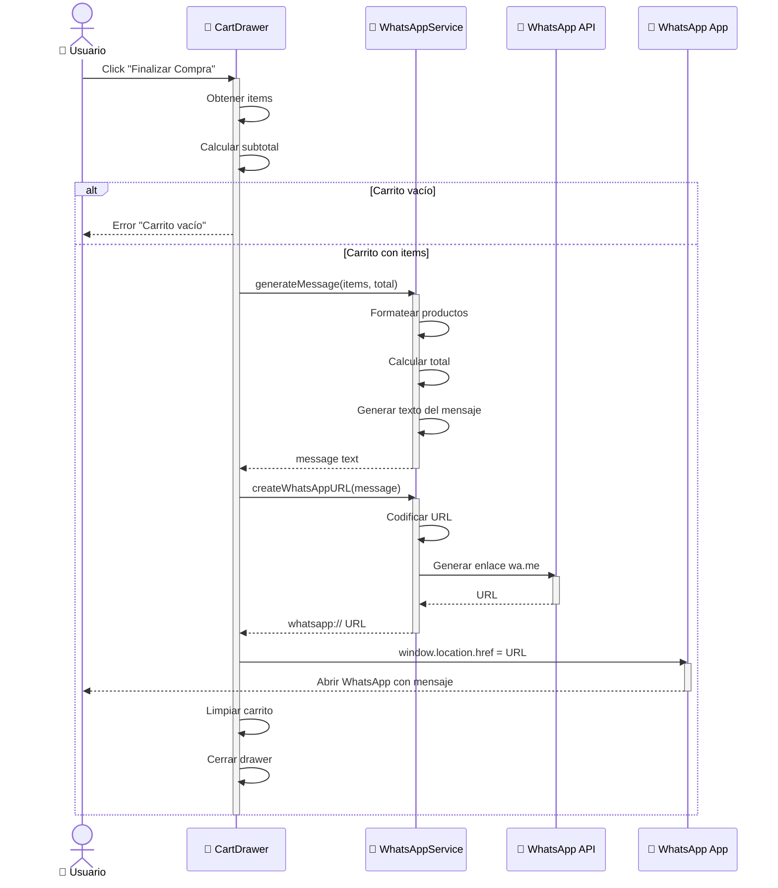

### Secuencia 3: Búsqueda AJAX

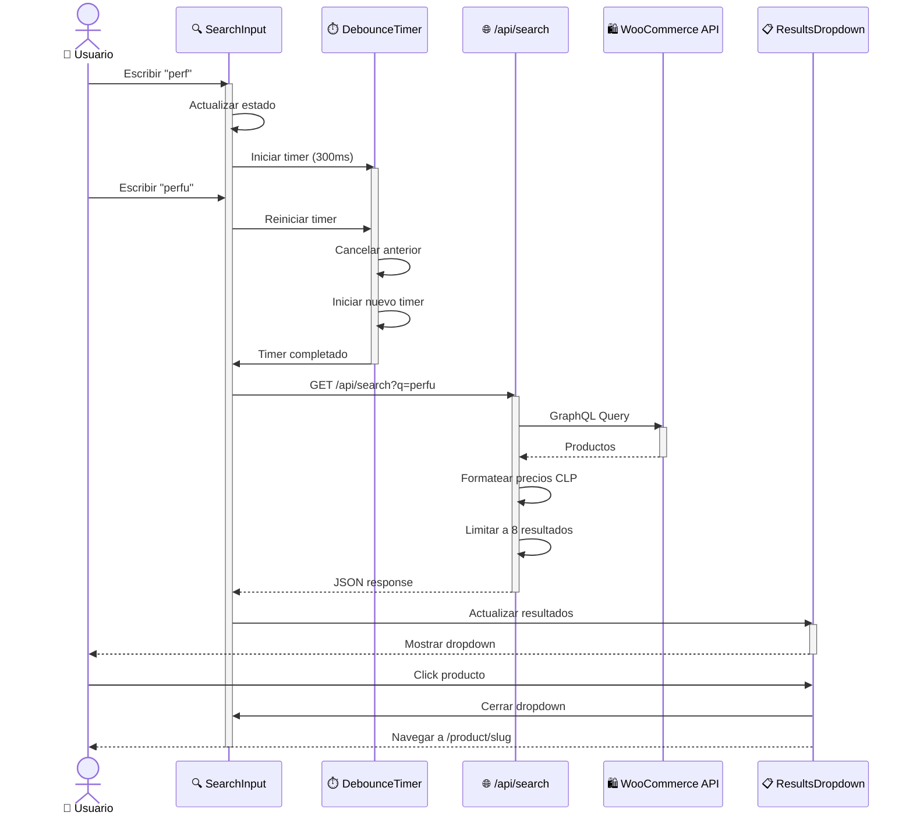

---

## Diagrama de Entidad-Relación

### Modelo de Datos

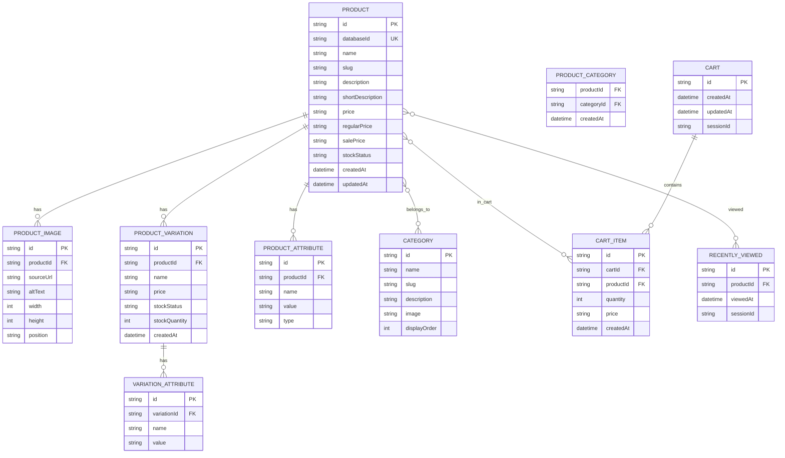

---

## Diagrama de Estados

### Estado del Carrito

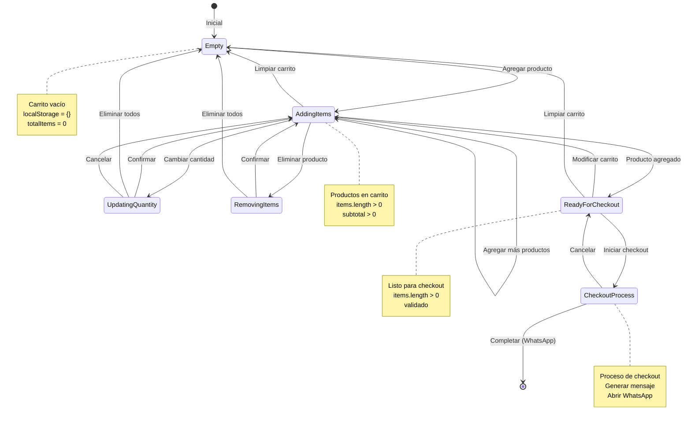

### Estado de Productos

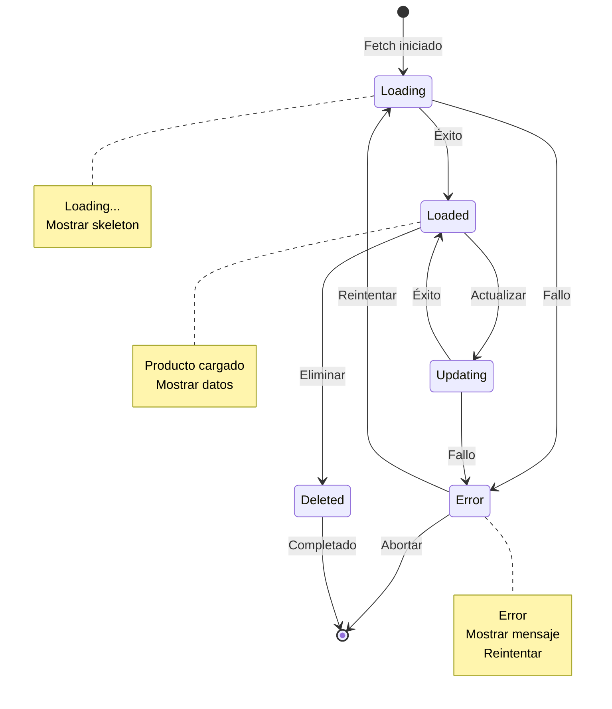

---

## Diagrama de Componentes

### Jerarquía de Componentes React

```mermaid
graph TB
    subgraph "App Root"
        Root[Root Layout]
    end

    subgraph "Layout Components"
        Navbar[WooNavbar]
        Footer[FooterCustom]
    end

    subgraph "Pages"
        HomePage[HomePage]
        ProductPage[ProductPage]
        CategoryPage[CategoryPage]
        SearchPage[SearchPage]
        CartPage[CartPage]
        CheckoutPage[CheckoutPage]
    end

    subgraph "Product Components"
        ProductCard[ProductCard]
        ProductDesc[ProductDescriptionWoo]
        ProductGrid[ProductGrid]
        RecentlyViewed[RecentlyViewedProducts]
    end

    subgraph "Cart Components"
        CartIcon[CartIcon]
        CartDrawer[CartDrawer]
        CartItem[CartItemComponent]
    end

    subgraph "UI Components"
        BannerCarousel[BannerCarousel]
        CategoryCard[CategoryCard]
        SearchBar[WooSearch]
        CategoryDropdown[CategoryDropdown]
    end

    subgraph "Providers"
        CartProvider[CartProvider]
        RecentlyViewedProvider[RecentlyViewedProvider]
    end

    %% Conexiones
    Root --> Navbar
    Root --> Footer
    Root --> HomePage

    Navbar --> SearchBar
    Navbar --> CategoryDropdown
    Navbar --> CartIcon

    HomePage --> BannerCarousel
    HomePage --> ProductGrid
    HomePage --> CategoryCard
    HomePage --> RecentlyViewed

    ProductPage --> ProductDesc
    ProductPage --> RecentlyViewed

    CategoryPage --> ProductGrid

    ProductGrid --> ProductCard

    CartDrawer --> CartItem

    %% Providers envuelven la app
    CartProvider -.-> Navbar
    CartProvider -.-> CartDrawer
    RecentlyViewedProvider -.-> RecentlyViewed

    %% Estilos
    classDef layout fill:#4CAF50,stroke:#2E7D32,color:#fff
    classDef page fill:#2196F3,stroke:#1565C0,color:#fff
    classDef component fill:#FF9800,stroke:#E65100,color:#fff
    classDef provider fill:#9C27B0,stroke:#6A1B9A,color:#fff

    class Navbar,Footer layout
    class HomePage,ProductPage,CategoryPage page
    class ProductCard,CartDrawer,BannerCarousel component
    class CartProvider,RecentlyViewedProvider provider
```

---

## Patrones de Diseño

### 1. Provider Pattern

**Uso**: Estado global del carrito y productos vistos

```typescript
// providers/CartProvider.tsx
export function CartProvider({ children }) {
  const [state, setState] = useState(initialState);

  const addToCart = async (id, quantity, product) => {
    // Lógica del carrito
  };

  return (
    <CartContext.Provider value={{ state, addToCart, ... }}>
      {children}
    </CartContext.Provider>
  );
}

// Uso en componentes
function Component() {
  const { addToCart } = useCart();
  // ...
}
```

### 2. Compound Component Pattern

**Uso**: Componentes con sub-componentes relacionados

```typescript
// Componente compuesto
export function Card({ children }) {
  return <div className="card">{children}</div>;
}

Card.Header = function Header({ children }) {
  return <div className="card-header">{children}</div>;
};

Card.Body = function Body({ children }) {
  return <div className="card-body">{children}</div>;
};

// Uso
<Card>
  <Card.Header>Título</Card.Header>
  <Card.Body>Contenido</Card.Body>
</Card>
```

### 3. Container/Presenter Pattern

**Uso**: Separación de lógica y presentación

```typescript
// Container - maneja lógica
export function ProductContainer() {
  const [product, setProduct] = useState(null);
  const [loading, setLoading] = useState(true);

  useEffect(() => {
    fetchProduct().then(data => {
      setProduct(data);
      setLoading(false);
    });
  }, []);

  if (loading) return <ProductSkeleton />;
  return <ProductView product={product} />;
}

// Presenter - solo renderiza
export function ProductView({ product }) {
  return (
    <div>
      <h1>{product.name}</h1>
      <p>{product.price}</p>
    </div>
  );
}
```

### 4. Custom Hook Pattern

**Uso**: Lógica reutilizable

```typescript
// hooks/useCart.ts
export function useCart() {
  const context = useContext(CartContext);
  if (!context) {
    throw new Error('useCart must be used within CartProvider');
  }
  return context;
}

// hooks/useRecentlyViewed.ts
export function useRecentlyViewed() {
  const [viewed, setViewed] = useState([]);

  const addViewed = (product) => {
    setViewed(prev => [product, ...prev].slice(0, 10));
  };

  return { viewed, addViewed };
}
```

### 5. Higher-Order Component (HOC) Pattern

**Uso**: withLoading, withErrorBoundary

```typescript
export function withLoading<P>(
  Component: React.ComponentType<P>
) {
  return (props: P & { loading?: boolean }) => {
    if (props.loading) {
      return <LoadingSkeleton />;
    }
    return <Component {...props} />;
  };
}

// Uso
const ProductCardWithLoading = withLoading(ProductCard);
```

### 6. Render Props Pattern

**Uso**: Componentes que necesitan flexibilidad en el renderizado

```typescript
export function DataFetcher({ render, url }) {
  const [data, setData] = useState(null);

  useEffect(() => {
    fetch(url).then(setData);
  }, [url]);

  return render(data);
}

// Uso
<DataFetcher
  url="/api/products"
  render={(data) => <ProductGrid products={data} />}
/>
```

---

## Flujo de Datos

### Flujo de Datos Unidireccional

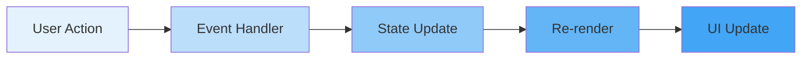

### Flujo de Datos en el Carrito

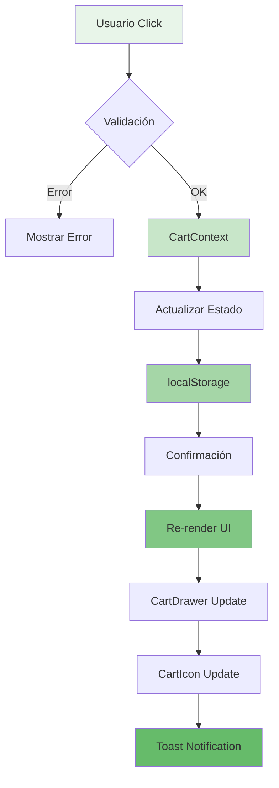

---

## Referencias

- [Next.js 15 Architecture](https://nextjs.org/docs/app/building-your-application/architecture)
- [React Patterns](https://reactpatterns.com/)
- [Mermaid Diagrams](https://mermaid.js.org/)
- [JAMstack Architecture](https://jamstack.org/)

**Fuentes consultadas**:
- [AI Architecture Capabilities - CSDN](https://blog.csdn.net/qq_38196449/article/details/157059998)
- [Next.js Markdown & Mermaid - CSDN](https://m.blog.csdn.net/gitblog_00786/article/details/152356939)
- [Your Next Store Architecture - CSDN](https://m.blog.csdn.net/gitblog_00161/article/details/152243773)

---

**Versión**: 1.0.0
**Última actualización**: Marzo 2026
**Autor**: Pinneacle Perfumería Tech Team
