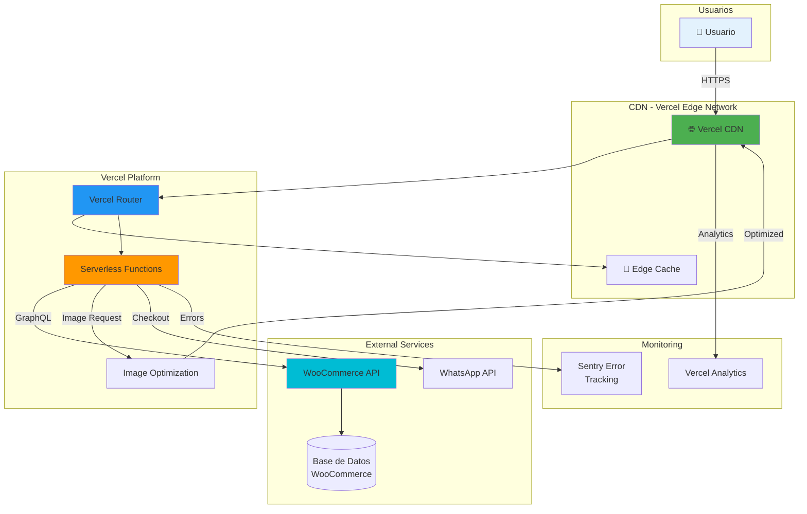
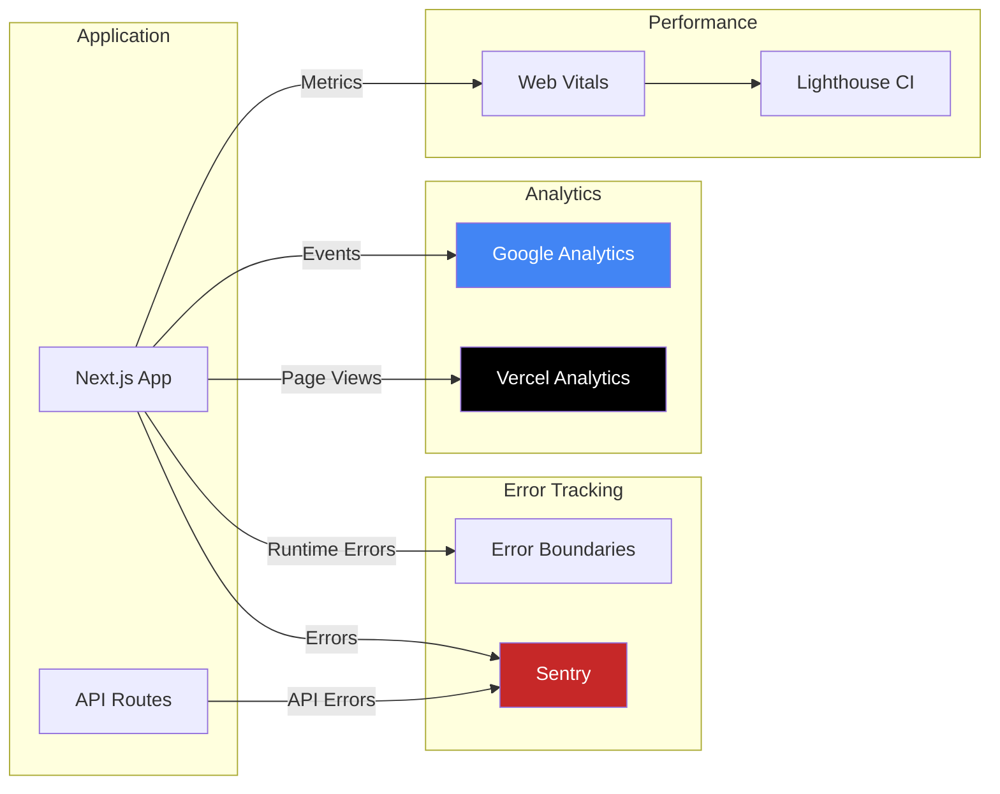
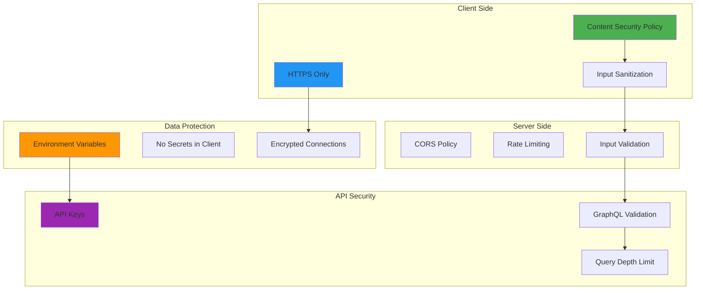
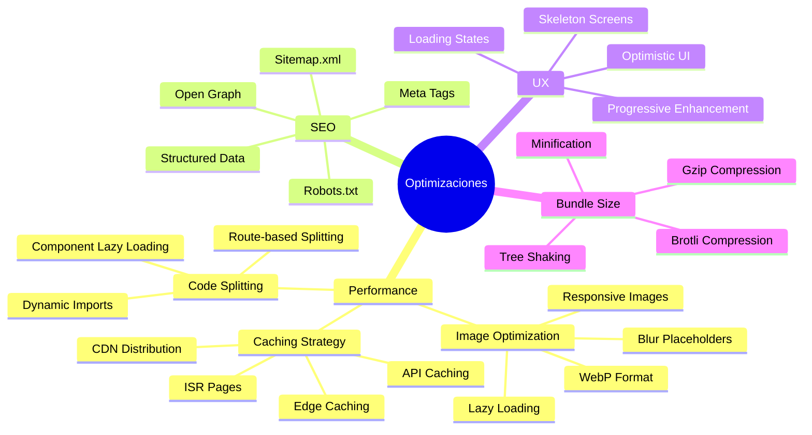
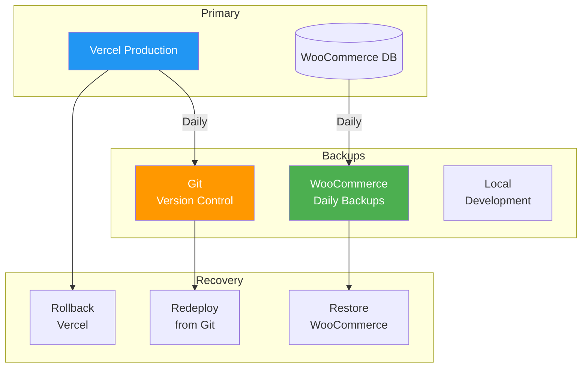

# Infraestructura y Deployment - Pinneacle Perfumería

## 📋 Índice

1. [Arquitectura de Deployment](#arquitectura-de-deployment)
2. [Diagrama de Infraestructura](#diagrama-de-infraestructura)
3. [Flujo de Deploy](#flujo-de-deploy)
4. [Ambientes](#ambientes)
5. [Monitoreo y Logging](#monitoreo-y-logging)
6. [Security](#security)
7. [Optimizaciones](#optimizaciones)

---

## Arquitectura de Deployment

### Arquitectura Serverless en Vercel



---

## Diagrama de Infraestructura

### Vista Completa del Sistema

```mermaid
graph TB
    subgraph "Client Side"
        Browser[🌐 Navegador Web]
        LocalStorage[(localStorage<br/>pinneacle_cart)]
    end

    subgraph "Vercel Edge - Global Distribution"
        Edge1[Edge: Santiago]
        Edge2[Edge: Lima]
        Edge3[Edge: Bogotá]
    end

    subgraph "Vercel Platform"
        NextJs[Next.js 15 App]
        APIRoutes[API Routes]
        ISR[ISR Pages]
    end

    subgraph "Vercel Edge Functions"
        SearchFn[/api/search]
        GraphFn[/api/graphql]
    end

    subgraph "WooCommerce Backend"
        WooAPI[GraphQL API]
        WooDB[(MySQL Database)]
        WooMedia[Media Library]
    end

    subgraph "Third Party Services"
        WhatsApp[WhatsApp Business API]
        Sentry[Sentry APM]
        VercelAnal[Vercel Analytics]
    end

    Browser -->|HTTP/2| Edge1
    Browser -->|HTTP/2| Edge2
    Browser -->|HTTP/2| Edge3

    Edge1 --> NextJs
    Edge2 --> NextJs
    Edge3 --> NextJs

    NextJs --> APIRoutes
    NextJs --> ISR

    APIRoutes --> SearchFn
    APIRoutes --> GraphFn

    SearchFn --> WooAPI
    GraphFn --> WooAPI

    WooAPI --> WooDB
    WooAPI --> WooMedia

    Browser <-->|Read/Write| LocalStorage

    APIRoutes -->|Error Events| Sentry
    NextJs -->|Performance| VercelAnal

    APIRoutes -->|WhatsApp Links| WhatsApp

    style Browser fill:#1565C0,color:#fff
    style LocalStorage fill:#7B1FA2,color:#fff
    style NextJs fill:#2E7D32,color:#fff
    style WooAPI fill:#F57C00,color:#fff
    style WhatsApp fill:#25D366,color:#fff
```

---

## Flujo de Deploy

### Pipeline de CI/CD con Vercel

```mermaid
sequenceDiagram
    actor Dev as 👨‍💻 Desarrollador
    participant Git as 📦 GitHub
    participant Vercel as ⚡ Vercel
    participant Build as 🔨 Build Process
    participant Deploy as 🚀 Deploy
    participant Edge as 🌐 Edge Network

    Dev->>Git: git push main
    activate Git

    Git->>Vercel: Webhook: Push event
    activate Vercel

    Vercel->>Build: Iniciar build
    activate Build

    Build->>Build: pnpm install
    Build->>Build: pnpm build
    Build->>Build: Generar static files
    Build->>Build: Optimizar imágenes
    Build->>Build: Minificar JS/CSS

    alt Build Success
        Build-->>Vercel: Build OK
        deactivate Build

        Vercel->>Deploy: Desplegar a producción
        activate Deploy

        Deploy->>Edge: Distribuir a edges globales
        activate Edge
        Edge-->>Deploy: Confirmación
        deactivate Edge

        Deploy-->>Vercel: Deploy completado
        deactivate Deploy

        Vercel->>Git: Update deployment status
        Vercel-->>Dev: ✅ Deploy successful
        deactivate Vercel

    else Build Error
        Build-->>Vercel: ❌ Build failed
        deactivate Build

        Vercel-->>Dev: Error logs
        Vercel->>Git: Update status: failed
        deactivate Vercel
    end

    deactivate Git
```

### Proceso de Build Detallado


---

## Ambientes

### Configuración de Ambientes

```mermaid
graph TB
    subgraph "Development"
        DevLocal[localhost:3000]
        DevEnv[.env.local]
    end

    subgraph "Preview"
        Preview[vercel.app/pr-*]
        PreviewEnv[Preview Environment]
    end

    subgraph "Production"
        Prod[pinneacleperfumeria.com]
        ProdEnv[Production Environment]
    end

    DevLocal -->|Git Push PR| Preview
    Preview -->|Merge to main| Prod

    style DevLocal fill:#E8F5E9
    style Preview fill:#FFF3E0
    style Prod fill:#FFEBEE
```

### Variables de Entorno por Ambiente

| Variable | Development | Preview | Production |
|----------|-------------|---------|------------|
| `NEXT_PUBLIC_WOOCOMMERCE_URL` | localhost | staging URL | production URL |
| `NEXT_PUBLIC_SITE_URL` | localhost:3000 | preview URL | pinneacleperfumeria.com |
| `NODE_ENV` | development | production | production |
| `SENTRY_DSN` | - | Preview DSN | Production DSN |

---

## Monitoreo y Logging

### Arquitectura de Monitoreo



### Métricas Monitoreadas

#### Performance
- **FCP** (First Contentful Paint): < 1.8s
- **LCP** (Largest Contentful Paint): < 2.5s
- **CLS** (Cumulative Layout Shift): < 0.1
- **FID** (First Input Delay): < 100ms
- **TTFB** (Time to First Byte): < 600ms

#### Errors
- JavaScript errors
- API failures
- Network errors
- Resource loading errors

#### Business
- Cart conversion rate
- Search usage
- Product views
- Checkout initiation

---

## Security

### Medidas de Seguridad



### Security Headers Implementados

```http
# Headers de Seguridad
Content-Security-Policy: default-src 'self'; script-src 'self' 'unsafe-inline' 'unsafe-eval'; style-src 'self' 'unsafe-inline'
X-Frame-Options: DENY
X-Content-Type-Options: nosniff
Referrer-Policy: strict-origin-when-cross-origin
Permissions-Policy: geolocation=(), microphone=(), camera=()
Strict-Transport-Security: max-age=31536000; includeSubDomains
```

---

## Optimizaciones

### Estrategias de Optimización



### Optimización de Imágenes

```typescript
// Configuración de imágenes en Next.js
const imageConfig = {
  formats: ['image/avif', 'image/webp'],
  deviceSizes: [640, 750, 828, 1080, 1200, 1920, 2048, 3840],
  imageSizes: [16, 32, 48, 64, 96, 128, 256, 384],
  minimumCacheTTL: 60, // 60 segundos
};

// Uso en componentes
<Image
  src={product.image}
  alt={product.name}
  width={400}
  height={533}
  className="object-cover"
  sizes="(max-width: 768px) 50vw, 25vw"
  priority={false}
  loading="lazy"
  placeholder="blur"
  blurDataURL="data:image/jpeg;base64,..."
/>
```

### Incremental Static Regeneration (ISR)

```typescript
// Páginas con ISR
export const revalidate = 3600; // 1 hora

export default async function HomePage() {
  // Se regenera cada hora
  const products = await getProducts();
  return <ProductGrid products={products} />;
}
```

---

## Costos y Recursos

### Estimación de Costos Mensuales (Vercel Pro)

| Servicio | Uso | Costo |
|----------|-----|-------|
| Hospedaje | Ilimitado | $20 USD |
| Ancho de banda | 1 TB | Incluido |
| Funciones Serverless | 100 GB-horas | Incluido |
| Edge Functions | Ilimitado | Incluido |
| Optimización imágenes | Ilimitado | Incluido |
| **Total** | | **$20 USD/mes** |

### Recursos del Plan Pro

- ✅ Ancho de banda: 1 TB/mes
- ✅ Serverless Functions: 100 GB-horas/mes
- ✅ Edge Functions: Ilimitado
- ✅ Build minutes: 6,000/minutos
- ✅ Deployments: Ilimitado
- ✅ Equipo: Ilimitado
- ✅ SSL gratuito

---

## Disaster Recovery

### Estrategia de Backup



### Plan de Recuperación

1. **Código Fuente**: Git (GitHub) - Backups automáticos
2. **Base de Datos**: Backups diarios de WooCommerce
3. **Media**: CDN de WooCommerce + Backup
4. **Configuración**: Variables de entorno en Vercel
5. **Tiempo de Recuperación**: < 15 minutos
6. **Punto de Recuperación**: Último backup exitoso

---

## Recursos Adicionales

- [Vercel Documentation](https://vercel.com/docs)
- [Next.js Deployment](https://nextjs.org/docs/deployment)
- [WooCommerce REST API](https://woocommerce.github.io/woocommerce-rest-api-docs/)
- [Web Vitals](https://web.dev/vitals/)
- [Security Headers](https://securityheaders.com/)

---

**Versión**: 1.0.0
**Última actualización**: Marzo 2026
**Autor**: Pinneacle Perfumería DevOps Team
